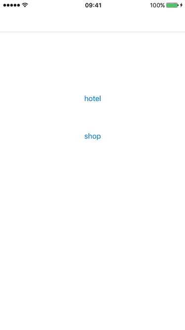
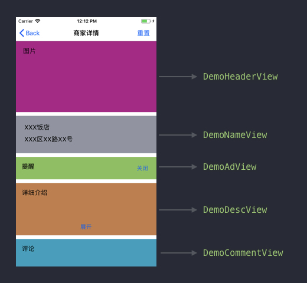
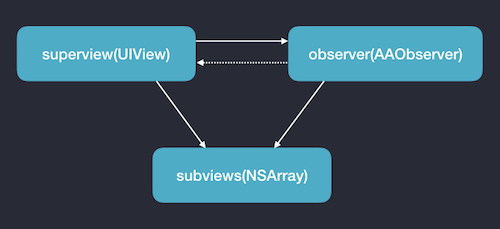

# AASubviews  -  Automatic arrangement subviews  
  
自动排列子视图  
  


## 调用说明:  
只需引入 `AASubviews.h` 后，调用下面的方法即可： 

```objective-c
+ (void)superview:(UIView *)superview subviews:(NSArray *)subviews;
```

## 使用场景:   
如果你使用 `frame` 来布局，这是一个很方便的工具。场景是这样的，一个页面由多个不同的展示元素组成，考虑到可维护性和扩展性，这些元素可以划分成从上至下排列的多个分组，一个分组就是一个自定义的 `subview` ，每个 `subview` 实现各自内部的展示逻辑，并且有以下特点：
* `subview` 的高度可能变化;
* `subview` 也可能突然隐藏或显示；
* 由于以上两点，`superview` 的高度也会跟着变化；
* `subview` 的排列顺序可能变化。

## 演示例子: 
例如需求是展示某个商家的详情页，对于酒店（Hotel）类型商家是下面这样展示的，并且，为了方便管理，从上至下划分为以下几个部分：  


还有交互上是这样的：点击“关闭”按钮会隐藏 `DemoAdView`，点击“展开”会使 `DemoDescView` 变高，点击“重置”会使所有 `view` 重置一遍。并且对于商店（Shop）类型的商家是有不同的展示方式。  

用 `AASubViews` 可以很方便的管理这种变化。
```objective-c
DemoHeaderView *headerView = [DemoHeaderView createViewFromXib];
DemoNameView *nameView = [DemoNameView createViewFromXib];
DemoAdView *adView = [DemoAdView createViewFromXib];
DemoDescView *descView = [DemoDescView createViewFromXib];
DemoCommentView *commentView = [DemoCommentView createViewFromXib];

NSArray *subviews = nil;
if (self.type == DemoTypeHotel) {
    subviews = @[headerView, nameView, adView, descView, commentView];
} else {
    subviews = @[adView, nameView, descView, commentView];
}

[AASubviews superview:self.scrollView subviews:subviews];
```

要查看更详细的代码请打开工程。

## 原理分析:
从上至下排列 `subviews`，使用 `KVO` 原理检测 `subview` 的 `frame` 和 `hidden` 变化，从而自动调整布局。

难点是，如果只是简单利用 `KVO` 用 `superview` 来观察 `subview` 的变化，会有很多问题，例如：
1. 如果重复 `addObserver` 会多次触发 `observeValueForKeyPath:ofObject:change:context` 方法；
2. 如果重复 `removeObserver` 会导致闪退；
3. 如果被观察者释放了而还没有 `removeObserver` 的话，也会导致闪退，模拟器不会发生，但是真机会发生；
4. `superview` 观察 `subview` ，实现 `observeValueForKeyPath:ofObject:change:context` 方法，最初想到有两种方式，第一种是自定义一个 `UIView` 的子类，所有的 `superview` 继承于这个类，这种方式改动太大了，不可取；第二种是用 `category` 的方式实现这个方法，这种方式会影响到整个工程所有的 `view` ，这种方式也不太好。

为了解决问题 1 和 2，可以每个 `subview` 做一个标记是否被观察了。为了解决问题 3 和 4，可以引入一个专门观察 `subview` 的类 `AAObserver`，然后 `superview` 持有这个类的实例。

以下是对象的引用关系，实线代表强引用，虚线代表弱引用：  


当 `addSubview` 的时候 `addObserver`，当 `removeFromSuperview` 的时候 `removeObserver`。但是当 `controller` 退出时 `superview` 自动释放时，导致 `subviews` 也会自动 `removeFromSuperview`， 因为我们无法获取 `removeFromSuperview` 的回调，这时候我们怎么 `removeObserver` 呢？看上面的引用关系图，因为 `observer` 是对 `subviews` 强引用的，所以 `observer` 的释放肯定在 `subviews` 的释放之前， `superview` 释放会导致 `observer` 释放，我们可以在 `obserview` 的 `dealloc` 方法里做 `removeObserver`。 这就巧妙地解决了没移除观察者的问题。


